# 나만의 동영상 스트리밍 시스템 설계하기(테크니컬 라이팅)

### 대상 독자

기본 웹 개발 지식(HTTP, REST API 등)에 대한 이해는 있으나 처음 VOD 스트리밍 플랫폼을 구축하려는 주니어 개발자

소규모로 시작하지만, 사용자가 늘어날 것을 대비해 확장 가능한 아키텍처를 설계해야 하는 개발자

****실제 구현 방법에 대해서는 다루지 않습니다****

## 이 글에서는..

### 첫 번째. 동영상 스트리밍의 핵심 개념

1. **일반적인 파일 전송과 스트리밍의 차이**는 무엇일까?
2. 인코딩? 트랜스코딩? 비트레이트? 해상도?
3. 스트리밍 전용 프로토콜이 있다고?

### 두 번째. 동영상 처리 과정의 다양한 방법들

1. 동영상 업로드 방법 3가지
2. 동영상 처리 파이프라인 실행 방법 3가지
3. 저장 및 배포 전략 2가지

각 방법의 장단점과 선택 기준에 대해 주로 이야기할 것이다.

### 세 번째. 나만의 동영상 스트리밍 시스템 설계하기

1. 선택한 동영상 처리 방법들과 그 이유
2. 동영상 업로드부터 재생까지 아키텍처 설명
3. 동영상 업로드 실시간 알람 설계

# 동영상 스트리밍의 핵심 개념을 알아보자

## 1. 일반적인 파일 다운로드와 스트리밍의 차이?

일반적인 파일 전송의 핵심은 **다운로드**이다.

다운로드는 외부에 있는 데이터를 내 컴퓨터로 가져오는 것이다. 즉, 클라이언트가 요구하는 파일 전체를 서버로부터 받는 과정이라 볼 수 있다. 우리가 쉽게 볼 수 있는 일반적인 이미지들도 모두 서버로부터 파일 데이터를 모두 가져온 후 보여주는 것이다.

이미지, 파일과 같은 작은 크기의 데이터는 문제가 되지 않았다. 보통 수십KB ~ 수MB의 크기이기에 다운로드 시간이 길지 않았기 때문이다. 하지만, 동영상 같은 큰 데이터인 경우 문제가 발생했다. 수백MB ~ 수GB의 크기까지 도달하는 동영상의 데이터를 받아오기까지 수십 분에서 수 시간을 기다려야하는 경우가 발생한다. 만약 네트워크 환경이 좋지 않은 경우라면 더 오랜 시간이 걸리거나 끊김 현상이 발생할 것이다. 예를 들어, 현재 많이 즐겨보는 유튜브 영상 하나를 시청할 때마다 수십 분을 기다린다면 인기를 얻을 수 없었을 것이다.

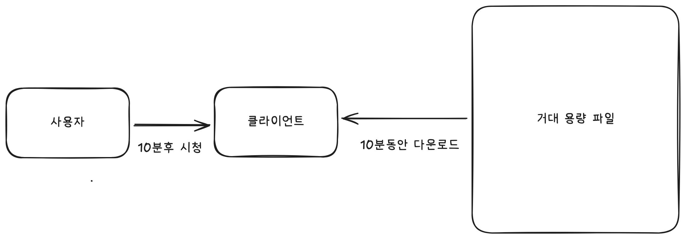

이러한 문제를 해결하기 위해 등장한 것이 바로 **스트리밍**이다.

스트리밍은 모든 데이터를 받아온 후 사용하는 것이 아닌, 미리 작은 조각(세그먼트)으로 나누어진 파일들을 순차적으로 다운로드하며 받은 부분부터 재생하는 방식이다. 예를 들어, 동영상 같은 경우 사용자는 앞부분의 데이터만 미리 받아온 후 그 부분만 재생을 시작하는 것이다. 앞 부분을 보며 기다린 만큼 뒷 부분 데이터를 받아오며 끊기지 않고 재생될 수 있는 것이다.

이때 세그먼트들의 정보(영상의 길이, 사용 가능한 화질 목록, 각 세그먼트의 재생시간 등)를 담은 **플레이리스트**를 먼저 다운로드한다는 것을 기억하자.

이로 인해 큰 데이터 전체를 받아오는 대기 시간을 줄여 사용자 경험을 개선할 수 있게 된 것이다.

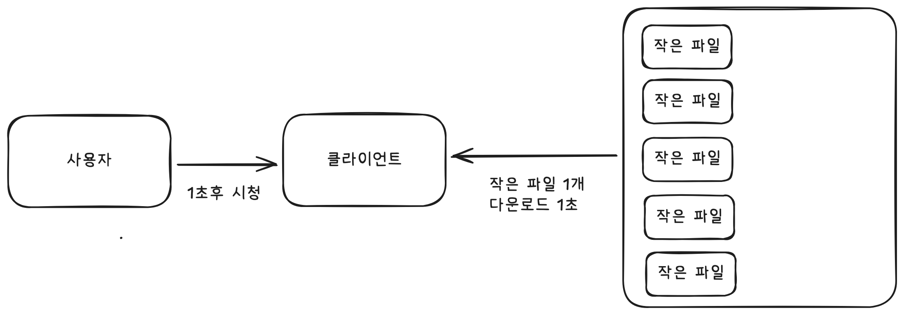

**Q. 동영상이 아닌 크기가 큰 파일도 있지 않나요? 그런 파일도 스트리밍 하나요?**

일반적으로는 스트리밍하지 않는다.

스트리밍 가능 여부를 판단할 때 핵심은 **"전체 파일이 다운로드되기 전에 일부 데이터만으로 의미 있는 작업을 수행할 수 있는가"이다**.

1GB의 엑셀 문서, 5GB의 압축 파일, 10GB의 게임 실행 파일 등은 일부분만으로는 사용할 수 없다. 전체 파일이 있어야 문서가 열리고 프로그램이 실행되는데, 이는 파일 구조상 헤더, 메타데이터, 실제 데이터가 서로 참조하고 의존하고 있기 때문이다.

반면 동영상과 오디오는 시간 순서대로 독립적인 프레임과 샘플로 구성되어 있어, 앞부분부터 순차적으로 재생할 수 있다. 물론 동영상 내부의 프레임들도 GOP(Group of Pictures) 구조에서 서로 연관되어 있지만, 전체적으로는 순차 접근이 가능하도록 설계되어 있다. 동영상 외에도 Linearized PDF는 첫 페이지부터 순차적으로 볼 수 있고, Progressive JPEG은 저해상도부터 점진적으로 선명해지며, 로그 파일은 실시간으로 tail 명령어로 읽을 수 있다.

결국 스트리밍이 가능하려면 순차 접근이 가능해야 하고, 각 데이터 조각이 상대적으로 독립적이어야 하며, 무엇보다 파일 포맷 자체가 스트리밍을 고려해 설계되어야 한다.

**Q. 동영상 재생 중 중간 부분부터 보고 싶으면 어떻게 되나요?**

사용자가 재생 바를 클릭하면 해당 위치의 데이터를 새로 요청하게 된다.

미리 데이터를 받아오지 못한 부분이라면, 해당 부분의 데이터를 충분히 받을 때까지 잠시 대기해야 하는데, 이것이 바로 버퍼링이다.

그 이후, 요청한 위치부터 순차적으로 데이터를 받아오며 스트리밍한다.

## 2. 인코딩? 트랜스코딩? 비트레이트? 해상도?

조금은 진부할 수 있는 내용이지만 핵심 키워드들을 알아보자.

아래 사진을 이해하는 것이 목표다.

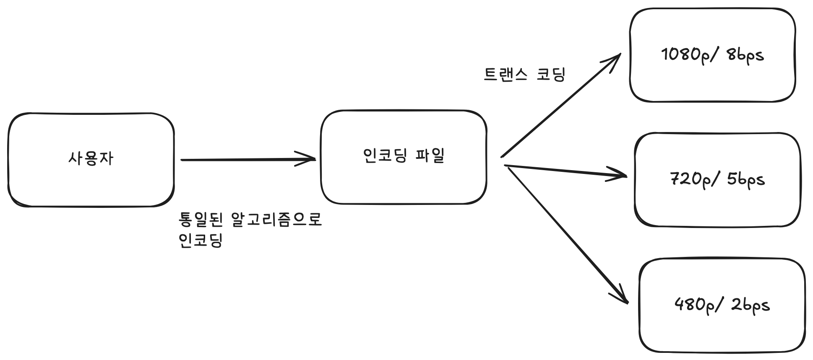

**인코딩은 원본 동영상 데이터를 압축하여 파일 크기를 줄이는 과정이다.**

카메라로 촬영한 원본 동영상은 용량이 매우 크다. 예를 들어, 1분짜리 4K 영상의 원본은 수 GB에 달할 수 있다. 이런 거대한 파일을 그대로 인터넷으로 전송하면 다운로드 시간이 너무 오래 걸리고, 서버 저장 공간도 많이 필요하다.

따라서 **코덱(Codec)**이라는 압축 알고리즘을 사용하여 데이터를 압축한다. 대표적인 코덱으로는 H.264, H.265(HEVC), VP9 등이 있다. 이러한 코덱들은 화질 손실을 최소화하면서도 파일 크기를 원본의 1/10 ~ 1/30 수준으로 줄일 수 있다.

압축 알고리즘은 호환성, 인코딩/디코딩 속도 등 용도에 따라 선택해야 한다.

**트랜스코딩은 이미 인코딩된 영상을 다른 포맷이나 품질로 다시 변환하는 과정이다.**

스트리밍 서비스는 다양한 환경의 사용자를 지원해야 한다. 빠른 와이파이를 사용하는 사람도 있고, 느린 모바일 데이터를 사용하는 사람도 있다. 큰 TV 화면으로 보는 사람도 있고, 작은 스마트폰 화면으로 보는 사람도 있다.

이를 위해 **하나의 원본 영상을 여러 가지 품질로 변환**한다. YouTube나 Netflix에서 화질을 선택할 수 있는 이유가 바로 이 때문이다. 예를 들어 1080p + 8Mbps, 720p + 5Mbps, 720 + 2.5Mbps 등 여러 버전을 생성해 놓고 서버에 저장해 둔다. 이것을 사용자 환경에 맞춰 제공해준다. 보통 FFmpeg라는 라이브러리를 사용한다.

트랜스코딩 시점은 업로드 직후 서버에서 일어나며, 원본 품질보다 높은 품질은 생성하지 않는다.

**비트레이트는 초당 전송되는 데이터의 양(bits per second, bps)을 의미한다.** 단위는 보통 Mbps(메가비트 per 초) 또는 Kbps(킬로비트 per 초)를 사용한다.

여기서 주의할 점은 비트레이트가 높다고 해서 영상이 더 빠르게 전송되는 것은 아니다. 재생 시간은 동일하지만, 같은 1초를 표현하는 데 더 많은 데이터를 사용한다. 즉, 더 고품질의 영상 정보가 담겨있는 것이다. 또한, 초당 전송해야 할 데이터 양이 많아지므로 더 빠른 인터넷 속도가 필요하다. 만약 느린 인터넷 환경에서 높은 비트레이트 영상을 재생하면 데이터를 충분히 빠르게 받지 못해 버퍼링이 자주 발생하게 될 것이다.

**해상도는 영상의 가로x세로 픽셀 수를 의미한다.** 픽셀이 많을수록 더 선명하고 세밀한 화면을 볼 수 있다.

주요 해상도는 다음과 같다:

- 4K (UHD): 3840 x 2160 (약 830만 픽셀)
- 1080p (Full HD): 1920 x 1080 (약 207만 픽셀)
- 720p (HD): 1280 x 720 (약 92만 픽셀)
- 480p (SD): 854 x 480 (약 41만 픽셀)
- 360p: 640 x 360 (약 23만 픽셀)

해상도가 높을수록 화질이 좋지만, 그만큼 데이터의 크기도 크다.

**Q. 해상도와 비트레이트의 관계?**

같은 해상도라도 비트레이트가 다르면 화질이 달라진다. 1080p 영상이라도 10 Mbps, 5 Mbps, 2 Mbps에 따라 체감 화질에 차이가 있다.
해상도는 픽셀 개수(화면 크기)를 결정하고, 비트레이트는 각 픽셀을 얼마나 정확하게 표현할지를 결정한다. 따라서 픽셀이 많아도 비트레이트가 낮으면 색상과 디테일이 뭉개져 화질이 떨어지게 된다.

**Q. 해상도/bps는 어떻게 결정될까?**

두 가지 경우로 나뉘게 되는데, **Auto모드**와 **수동으로 해상도를 선택한 경우**다.

**Auto모드**에서 스트리밍 서비스는 네트워크 속도를 측정하여 Mbps를 확인한 후 Mbps에 지원할 수 있는 해상도를 자동으로 선택한다. 예를 들어 10Mbps가 측정 되었다면, 1080p 해상도 영상을 충분히 지원할 수 있다고 결정한다. 이것을 **적응형 비트레이트 스트리밍(Adaptive Bitrate Streaming, ABR)**이라 한다.

**수동으로 해상도를 선택한 경우**에는 해상도는 고정되지만 네트워크 상황에 따라 비트레이트는 여전히 자동으로 조절된다.

예를 들어, 사용자가 1080p를 선택했을 때 같은 1080p라도 측정한 Mbps에 따라 영상의 버전을 선택해 제공한다. 만약 5Mbps라면 1080p 5Mbps 영상을 제공하고, 8Mbps라면 1080p 8Mbps 영상ㅇ을 제공하는 것이다.

## 3. 스트리밍 전용 프로토콜이 있다고?

초기에는 일반 HTTP 프로토콜로 동영상을 전송했다. 하지만 큰 문제가 있었다.

**사용자의 네트워크 상황은 고정되어 있지 않다.** 사용자가 와이파이에서 모바일 데이터로 전환하거나, 지하철을 타면서 신호가 약해지거나, 여러 사람이 동시에 같은 네트워크를 사용하면서 속도가 느려지는 등 네트워크 환경은 실시간으로 변한다.

일반 HTTP로 고정된 품질의 동영상을 전송하면 어떻게 될까? 네트워크가 느려졌을 때 높은 품질의 영상을 계속 받으려다 버퍼링이 자주 발생하게 된다. 반대로 네트워크가 빨라졌을 때도 낮은 품질의 영상만 계속 보게 되어 사용자 경험이 떨어진다.

**"네트워크 상황에 따라 동영상 품질을 실시간으로 자동 조절할 수는 없을까?"**

이런 고민에서 탄생한 것이 바로 **적응형 스트리밍 프로토콜**이다.

2025년 현재 HLS(HTTP Live Streaming)가 대부분의 동영상 플랫폼에서 사용하는 표준 프로토콜이다. 거의 모든 디바이스와 호환성과 안정성이 이유이다.

클라이언트는 다음과 같이 재생한다.

1. 플레이리스트 파일(m3u8)을 다운로드하여 어떤 품질들이 있는지 확인
2. 현재 네트워크 속도를 측정해 적절한 품질 선택
3. 선택한 품질의 조각을 다운로드하며 재생
4. **핵심 : 매 조각을 다운로드할 때마다 네트워크 속도를 다시 측정**
5. 네트워크 속도가 떨어지면 낮은 품질로 변환, 올라가면 높은 품질로 변환.

이처럼 사용자 네트워크 환경에 맞춰 품질을 실시간으로 변경한다. 이로인해 사용자는 화질이 순간적으로 조금 떨어지더라도 영상이 멈추지 않고 계속 재생되는 경험을 하게 된다.

이 외에도 **DASH**(HLS와 유사한 국제 표준), **RTMP**(라이브 방송 업로드 전용), **WebRTC**(화상회의용 극저지연 프로토콜) 등이 있다.

아래 그림으로 쉽게 알아보자!

첫 번째는 네트워크가 빠른 경우이다.

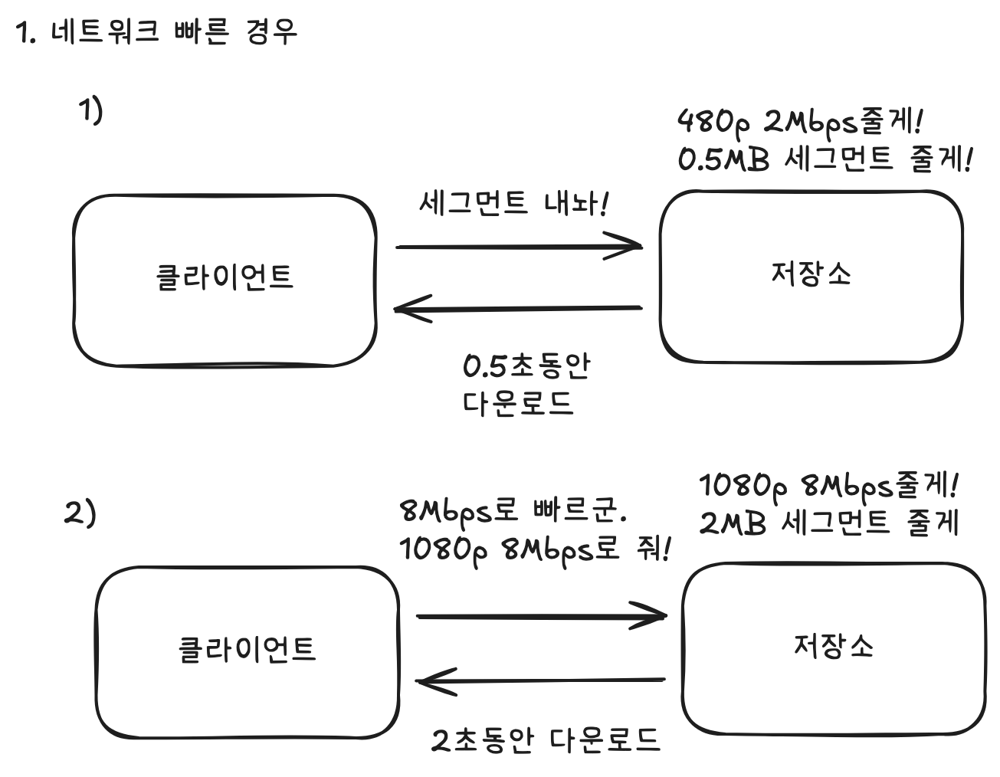

두 번째는 네트워크가 느린 경우이다.

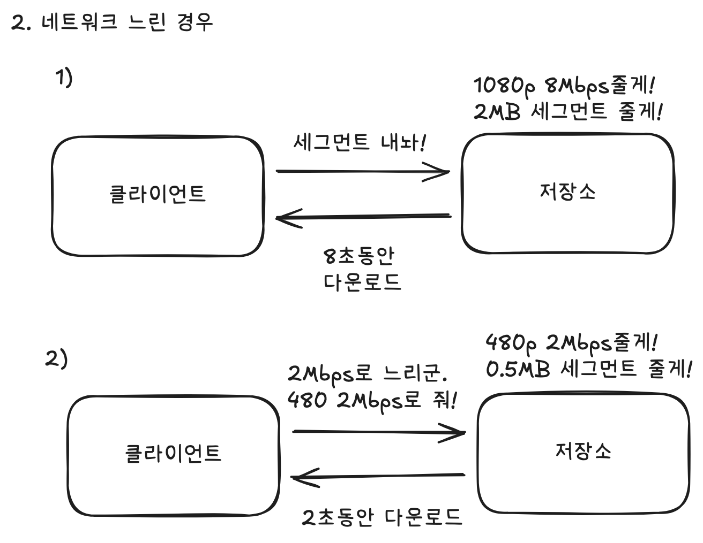

**Q. 사용자 네트워크 속도는 어떻게 측정할까?**

**세그먼트 / 다운로드 속도**로 계산한다.

예를 들어 2MB파일을 2초동안 다운로드 했다면, (2MB * 8) / 2 = 2Mbps 이다.

**Q. 처음에 가져오는 파일은 무엇일까?**

세그먼트를 다운로드받는 속도를 계산하여 적응형 스트리밍을 지원한다고 했는데, 첫 다운로드 파일을 어떻게 지정하는지 궁금했다.

세 가지 방법이 있다.

첫 번째는 초기에 낮은 화질로 재생을 시작하고 1~2개 세그먼트를 다운로드한 후 네트워크 속도를 측정해 화질을 올리는 방법이다.

두 번째는 테스트 전용 세그먼트 조각을 보내, 첫 세그먼트부터 적절한 화질을 선택하는 방법이다.

세 번째는 같은 사용자에서 이전에 측정된 속도를 캐시해두고, 다음 재생 시 첫 세그먼트 화질을 그 값으로 바로 추정한다.

# 동영상 처리 과정의 다양한 방법들

## 1. 동영상 업로드 방법 3가지

**방법 1: 단순 HTTP 업로드**

가장 기본적인 방법으로, 일반적인 파일 업로드와 동일하다. 사용자가 파일을 선택하면 브라우저가 HTTP POST 요청으로 파일 전체를 서버에 전송하고, 서버는 요청을 받아 파일을 저장한다.

구현이 매우 간단하다는 것이 가장 큰 특징이다. 기본 HTML form과 백엔드 파일 처리만 있으면 되고, 추가 라이브러리도 필요 없으며 일반적인 웹 서버 설정 그대로 사용할 수 있다. 작은 파일(100MB 미만)만 다루거나 MVP 단계에서 빠르게 구현하고 싶을 때, 사용자가 많지 않고 네트워크 환경이 안정적인 경우에 적합하다.

하지만 1GB 이상의 대용량 파일 업로드 시 매우 오래 걸리고, 중간에 끊기면 처음부터 다시 업로드해야 한다. 서버가 파일을 모두 처리한 뒤 응답하므로 큰 파일은 업로드 중 타임아웃이 발생할 수 있다. 또한 여러 사용자가 동시에 큰 파일을 업로드하면 서버 메모리에 부담이 된다.

**방법 2: 청크 업로드**

파일을 작은 조각(청크)으로 나누어 순차적으로 업로드하는 방식이다. 클라이언트가 파일을 여러 청크로 분할하고(예: 5MB 단위), 각 청크를 순서대로 서버에 전송한다. 서버는 받은 청크들을 임시로 저장했다가 모든 청크가 도착하면 하나의 파일로 합친다.

특정 청크 업로드가 실패하면 해당 청크만 다시 전송하면 되므로 처음부터 다시 시작할 필요가 없다. 청크 단위로 업로드 상태를 알 수 있어 사용자에게 정확한 진행률을 보여줄 수 있고, 작은 청크 단위로 처리하므로 서버 메모리 부담도 적다. 수 GB 파일도 안정적으로 업로드할 수 있어 대용량 파일을 다루거나 불안정한 네트워크 환경의 사용자가 많은 경우, 사용자 경험을 중시하는 서비스(YouTube, Vimeo 등)에서 사용한다.

다만 클라이언트와 서버 모두 청크 관리 로직이 필요하여 구현 복잡도가 증가한다. 서버에서는 청크를 저장하기 위한 임시 파일을 미리 생성해 두어야 하며, 청크를 모두 수집한 뒤 재조합 과정이 필요하다.

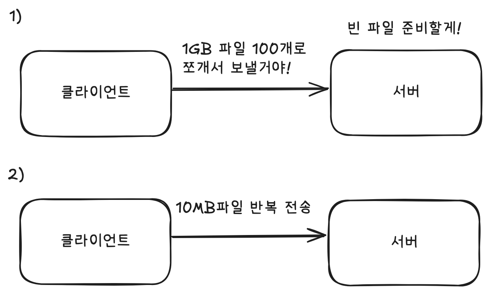

**방법 3: Presigned/Signed URL 업로드**

클라우드 스토리지(AWS S3, Google Cloud Storage)에 직접 업로드하는 방식이다. 클라이언트가 서버에 업로드 권한이 담긴 URL을 요청하면, 서버는 임시 업로드 URL(Presigned URL)을 생성하여 응답한다. 클라이언트는 받은 URL로 클라우드 스토리지에 직접 파일을 업로드하고 서버에 메타데이터 저장을 요청하는 등 후속 처리를 진행한다.

파일 데이터가 서버를 거치지 않고 클라우드로 직접 전송되어 서버 부하가 최소화되고 서버의 네트워크 비용도 크게 줄일 수 있다. 클라우드 제공자의 글로벌 인프라를 활용하여 빠른 업로드 속도를 낼 수 있고, 많은 사용자가 동시에 업로드해도 서버 부담이 없어 확장성이 뛰어나다. 사용자 규모가 크거나 빠르게 성장하는 서비스, 서버 인프라 비용을 최적화하고 싶은 경우, 이미 클라우드 스토리지를 사용 중인 경우나 글로벌 서비스에 적합하다.

하지만 AWS S3나 Google Cloud Storage 같은 외부 서비스가 필수이고, Presigned URL 생성 시 권한과 만료 시간을 정확히 설정해야 하는 등 보안 관리가 복잡하다. 클라우드 스토리지 사용료와 데이터 전송 비용이 발생하며, 브라우저에서 직접 업로드하려면 클라우드 스토리지에 CORS 설정이 필요하다.

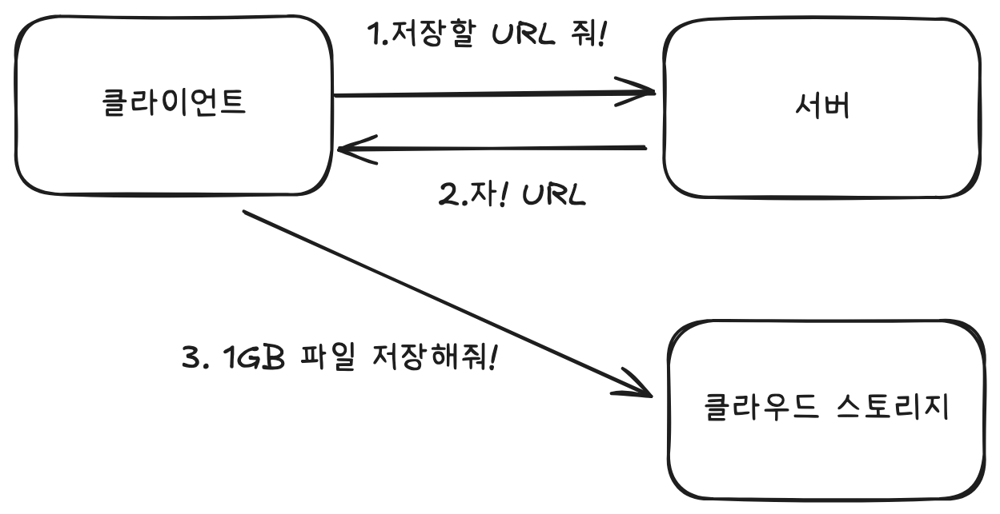

**Q. 어떤 방법을 선택해야 할까???**

초기 MVP 단계에서는 **방법 1(단순 HTTP 업로드)**로 시작하고 파일 크기를 일정 크기 이하로 제한하면 충분히 운영 가능하다. 동시 사용자가 증가하거나, 대용량 파일이 많은 경우 **방법 2(청크 업로드)**로 전환하여 사용자 경험을 개선할 수 있다. 만약, 일일 업로드가 수천, 수만 건을 넘어간다면 **방법 3(Presigned URL 업로드)**으로 전환하여 서버 부하를 줄일 수 있다.

실제로는 **방법 2와 3을 결합(Presigned URL + 청크 업로드)**하여 클라우드 스토리지에 청크 단위로 업로드하는 방식이 가장 이상적이다. AWS에서는 S3 Multipart Upload가 이 방식을 지원한다.

## 2. 동영상 처리 파이프라인 실행 방법 3가지

사용자가 동영상 업로드를 시작한 후, 원본 파일 저장부터 여러 품질로 변환, 썸네일을 생성, HLS용 세그먼트(.ts 등)로 분할 저장하기까지의 전체 과정을 **동영상 처리 파이프라인**이라고 하겠다.

그렇다면 이 파이프라인을 어떻게 실행할 것인가? 업로드 요청을 받은 서버가 직접 처리할 것인가, 아니면 별도의 워커 서버에 위임할 것인가? 자체 인프라를 구축할 것인가, 클라우드 서비스를 사용할 것인가?

파이프라인 실행 방법에 따라 처리 속도, 비용, 확장성이 크게 달라진다.

**[가정 : 동영상 업로드는 단순 HTTP 업로드인 상황]**

**방법 1: 동기 처리**

가장 단순한 방법으로, 원본 동영상 업로드 HTTP 요청과 같은 흐름에서 모든 처리를 완료한다. 즉, 사용자가 동영상을 업로드하면 서버가 즉시 트랜스코딩, 썸네일 생성, 세그먼트 분할 등 모든 작업을 순차적으로 처리하고, 완료될 때까지 기다린 후 응답을 반환한다.

구현이 매우 간단하고 코드 흐름이 직관적이어서 작은 파일(1분 미만, 100MB 이하)만 다루는 초기 MVP에 적합하다.

하지만 치명적인 문제가 있다. 5분짜리 동영상을 3가지 품질로 처리하면 수 분이 걸리는데, 그동안 사용자는 업로드 화면에서 계속 기다려야 한다. 서버의 웹 프로세스가 동영상 처리에 묶여있어 다른 요청을 처리할 수 없고, 처리 중 에러가 발생하면 사용자가 처음부터 다시 업로드해야 한다. 여러 사용자가 동시에 업로드하면 서버가 금방 포화 상태가 된다.

**방법 2: 비동기 처리 - 자체 구축**

원본 동영상 업로드와 동영상 처리를 분리하여 처리하는 방식이다. 업로드한 원본 동영상이 저장소(S3 등)에 저장되면 즉시 응답을 반환하고, 처리 작업은 백그라운드 시스템(비동기 작업 위임, 메시지 큐 + 워커, Lambda 등)에 위임하여 비동기로 처리한다.

사용자는 원본 동영상 저장이 완료되면 즉시 HTTP 응답을 받아 다른 페이지로 이동하는 등 추가 작업을 할 수 있게된다. 서버 측면에서는 HTTP 커넥션 및 스레드를 장시간 점유하지 않아 리소스를 효율적으로 사용할 수 있고, 처리 실패 시에도 HTTP 요청이 이미 완료되었기 때문에 타임아웃 걱정 없이 백그라운드에서 재시도할 수 있다.

하지만 구현 방법에 있어 복잡도가 높아진다. 단순하게는 애플리케이션 내부에서 별도 스레드로 처리할 수 있지만, 서버 재시작이나 장애 시 작업이 손실될 수 있다. 안정성과 확장성을 위해서는 메시지 큐(RabbitMQ, AWS SQS 등)와 워커 시스템을 구성하거나 Lambda 같은 서버리스 함수를 사용해야 한다.

또한, 비동기 처리에서는 실패 전략을 신중하게 설계해야 한다. 트랜스코딩 작업은 시간이 오래 걸리고 네트워크 이슈, 리소스 부족, 코덱 오류 등 다양한 원인으로 실패할 수 있다. 이때 실패한 작업을 어떻게 처리할 것인지 다양한 대체 방안을 세워야 한다.

**방법 3: 비동기 처리 - 클라우드 관리형 서비스 (Managed Service)**

동영상 처리를 완전히 클라우드 서비스에 위임하는 방식이다. AWS MediaConvert,
Google Cloud Transcoder API 같은 서비스에 API 호출만으로 모든 작업을 요청하고,
처리 인프라는 클라우드가 알아서 관리한다.

예를 들어, MediaConvert를 사용하면 트랜스코딩 서버를 직접 구축 및 운영할 필요가 없다. 업로드된 영상에 대해 어떤 출력 포맷과 옵션(코덱/해상도/비트레이트 조합, HLS 세그먼트, 썸네일 등)을 Job이 정의하면, AWS가 내부적으로 리소스를 확장해 작업을 병렬로 처리해줍니다. 즉, 이는 트래픽이 몰려도 신경 쓸 필요 없다는 장점이 있다.

비용이 가장 큰 고려사항이다. 서울, AWS MediaConvert는 SD 영상 기준 분당 $0.0085의 비용이 든다. 10분 영상 일일 업로드가 10개, 3가지 품질 생성 기준으로 월 $76.5 정도다. 그렇기에 제한 설정이 중요한데, MediaConvert는 영상 길이를 기준으로 비용이 나가기 때문에 **영상 길이 제한과 사용자 업로드 횟수 제한을 설정**해야한다.

세밀한 커스터마이징도 제한적이다. MediaConvert는 해상도/코덱 변환, 기본 썸네일 생성, HLS 분할 등 일반적인 기능만 제공한다.  FFmpeg을 사용해 직접 구축한다면 다양한 옵션을 설정할 수 있다.

**Q. 어떤 방법을 선택할까?**

응답 시간이 매우 길어질 수 있기 때문에 최소한 비동기 처리는 해야한다는 생각으로 방법 1은 권장하지 않는다.

트랜스코딩 작업은 CPU/메모리 자원을 많이 사용하므로 애플리케이션 내 비동기 작업으로 처리하는 것도 추천하지 않는다.

초기에 일일 업로드 수가 많지 않고, 운영 부담을 줄일 수 있는 AWS MediaConvert와 같은 클라우드 관리형 서비스 사용을 권장한다. 앞서 말했듯이 구축 및 운영 비용을 줄일 수 있고, 출력 포맷과 옵션만 정의하면 된다는 점이 가장 큰 장점이다.

하지만, 일일 업로드 수가 많아지면서 비용이 커질 때, 최적화 하기 위해 자체 트랜스코딩 워커 서버를 구축하는 것이 좋아보인다. 보통 메시지 큐 + 워커 서버를 함께 사용한다.

# 나만의 동영상 스트리밍 시스템 설계하기

## 1. 선택한 동영상 처리 방법들과 그 이유

동영상 스트리밍 시스템을 설계하기 전, 현재 나의 서비스 상황을 아래와 같다. 모든 시스템을 설계할 때에는 상황에 맞춰 방법들을 선택하는 것이 좋다.

현재 동영상 스트리밍 시스템을 구축하고자 하는 서비스는 **띵동**이라는 서비스이다.

띵동은 명지대학교 동아리 통합 플랫폼으로, 다음과 같은 특성을 가지고 있다.

**시청(스트리밍) 대상**: 약 10,000명 (전체 학우)

**시청(스티리밍) 환경**: 불안정한 대학 와이파이 ****

**업로드 대상**: 약 400명 (동아리 회장 및 운영진)

**기존 제약**: 동영상 크기 300MB 이하만 업로드 가능

**사용중인 클라우드 서비스:** AWS

전체적으로 동영상 업로드과정에서는 비동기 방식으로 처리하였다.

그 이유는 앞서 설명한 비동기 처리의 장점들(사용자 대기 시간 단축, 서버 리소스 효율성 등) 때문이다.

**[업로드 방법 - 단일 Presigned URL 업로드]**

업로드 방법으로는 **단일 Presigned URL 업로드**를 선택했다.

서버를 거쳐 파일을 업로드하는 방식을 적용하지 않은 이유는 다음과 같다.

단순 HTTP 업로드 방식은 300MB 파일이 업로드될 때마다 서버 메모리에 전체 파일을 적재해야 하고, 서버를 거치는 방식은 클라이언트→서버→S3로 이중 전송이 발생하여 서버 대역폭을 과도하게 소비한다.

청크 단위로 나누어 업로드하더라도 각 청크마다 서버 메모리를 사용하고, 청크 상태 추적을 위한 세션 정보 관리와 디스크 I/O가 발생하며, 서버가 모든 데이터 전송의 중간 경유지가 되어 대역폭을 점유한다는 근본적인 문제는 해결되지 않는다. 또한, 청크의 개수만큼 HTTP 요청이 복잡하며, 구현 복잡도가 높다.

S3 Multipart Upload(Presigned URL + chunk) 방법을 사용하지 않은 이유는 용량 제한과 구현 복잡도다. 용량이 300MB 제한으로 걸려있고, 사용자는 크기가 큰 동영상을 많이 업로드 하지 않았다. 또한, S3 Mutipart Upload보다, 단일 Presigned URL이 단순했다.

Presigned URL의 선택 이유는 앞에서 말했던 장점과 같다!

**[트랜스코딩 설정 및 파이프라인 구축 방법 -  클라우드 관리형 서비스]**

띵동 서비스는 트랜스코딩 파이프라인 구축을 위해  **클라우드 관리형 서비스(AWS MediaConvert)**를 선택했다.

동영상 트랜스코딩은 CPU와 메모리를 집중적으로 사용하는 무거운 작업이어서 동기 처리 방식을 선택하지 않았다. 또한, 자체 서버에서 FFmpeg을 직접 실행하는 방식도 고려했지만, 다음과 같은 이유로 AWS MediaConvert를 선택했다.

첫째, 인프라 구축 및 운영 부담이 없다. 트랜스코딩 서버를 직접 구축하여 생기는 인스턴스 프로비저닝, 장애 대응 등 비용이 사라진다.

둘째, 자동 확장성을 제공한다. 동아리 홍보 기간처럼 업로드가 몰리는 시기에도 자동으로 리소스를 확장하여 처리한다.

셋째, 초기 비용이 합리적이다. 띵동 서비스는 약 400명의 업로더를 대상으로 하며, 일일 업로드 수가 많지 않은 초기 단계이다. MediaConvert는 사용한 만큼만 비용을 지불하는 종량제 방식이므로 초기에는 비용 부담이 크지 않다. 서울 리전 기준 SD 화질은 분당 약 $0.0085이다.

넷째, 간단한 설정만으로 다양한 출력을 생성할 수 있다. HLS 세그먼트 분할, 여러 해상도 생성, 썸네일 추출 등 스트리밍에 필요한 기능을 Job 설정만으로 처리할 수 있다.

트랜스코딩 설정은 아래와 같다.

코덱과 프로토콜을 선정하는 데 있어 가장 중요하게 생각한 점은 호환성이다. 그래서 선택한 조합은 **H264 + HLS** 조합이다. 사실상 표준인 H264는 거의 모든 디바이스와 호환되고, HLS도 마찬가지다.

불안정한 네트워크속에 ABR을 지원하기 위해 **240p, 480p, 720p** 세 가지 해상도로 HLS 출력을 구성했다. 1080p 이상의 고화질을 제공하지 않는 가장 큰 이유는 비용때문이다. 사용자 대부분이 노트북이나 모바일에서 시청하는 환경을 고려하면 720p까지만으로도 충분한 화질을 제공할 수 있을 것이라 예상했다.

각 해상도별 비트레이트는 720p 4Mbps, 480p 2Mbps, 240p 0.5Mbps로 설정했고, 오디오는 AAC 코덱에 128kbps를 사용하여 충분한 음질을 제공하였다. HLS 세그먼트는 10초 단위로 분할하여 적응성과 효율성의 균형을 맞췄다.

추가적으로 fps(frame per second)는 원본 영상을 그대로 사용했고, 썸네일은 영상 첫 번째 프레임을 사용했다.

## 2. 동영상 업로드부터 재생까지 아키텍처 설명

앞서 선택한 방법들을 바탕으로 띵동 서비스의 전체 아키텍처를 구성했다. 사용자가 동영상을 업로드하고, 이를 처리하여, 최종적으로 시청자가 재생할 수 있기까지의 전체 과정을 단계별로 살펴보자.

### **[동영상 업로드 과정]**

동영상 업로드 파이프라인은 크게 5단계로 구성된다:

1. **사용자가 업로드를 위한 Presigned URL 요청**
2. **Presigned URL로 S3 원본 저장소에 직접 업로드**
3. **S3 원본 저장소에 동영상 저장 완료 후 Lambda 함수 자동 호출**
4. **Lambda 함수 실행**
5. **MediaConvert Job 실행**

이제 각 단계를 자세히 살펴보자.

**1단계는 Presigned URL 요청이다.**

사용자가 동영상 업로드를 시작하면, 클라이언트는 먼저 백엔드 서버에 Presigned URL을 요청한다.

서버는 요청을 받아 파일 크기 검증 (300MB 이하인지 확인), 사용자 권한 확인 (동아리 운영진인지 확인), S3 Presigned URL 생성 (유효기간 5분)의 작업을 수행한다.

클라이언트는 이 URL과 함께 videoId, 만료 시간 등의 정보를 응답받는다.

**2단계는 클라이언트는 응답받은 Presigned URL로 S3 원본 저장소에 직접 업로드한다.**

**3단계는 S3 원본 저장소에 원본 동영상 저장 완료 후 Lambda 함수를 호출한다.**

동영상이 S3에 성공적으로 저장되면 **S3 이벤트**가 자동으로 발생하게 된다. 띵동 서비스는 S3 버킷의 원본 동영상 경로(`prod/VIDEO/`)에 `ObjectCreated` 이벤트 알림을 설정하여 Lambda 함수를 호출하도록 구성했다.

Lambda는 AWS의 서버리스 컴퓨팅 서비스로, 직접 작성한 함수 스크립트를 실행시켜주는 것이라 이해하면 된다.

Q. Lambda를 사용한 이유?

가장 큰 이유는 비용과 단순함이다.

Lambda가 아닌 선택지에는 SQS + EC2가 있을 것 같은데, SQS + EC2 방식은 S3 업로드 이벤트를 SQS로 받아 EC2 워커가 주기적으로 폴링하며 메시지를 처리하는 구조다. 하지만 이 방식은 EC2가 항상 실행 중이어야 하므로 업로드가 없어도 월 $30~50의 고정 비용이 발생한다.
반면 Lambda는 S3 이벤트를 직접 트리거로 받아 파일이 업로드되는 순간 즉시 실행되며, 실행 시간만큼만 비용을 지불한다. 띵동 서비스처럼 월 100건 정도 업로드되는 경우 Lambda 비용은 월 $0.03 정도로 거의 무료 수준이다.

또한, SQS + EC2는 서버 구축 및 운영 비용이 크고, 람다는 함수 로직만 작성하면 되서 편하다.

**4단계는 Lambda 함수 실행이다.**

Lambda가 S3 이벤트를 수신받고 실행되면 미리 정의된 트랜스코딩 설정(H.264 코덱, 240p/480p/720p 해상도, 10초 세그먼트)을 포함한 MediaConvert Job을 생성하여 실행한다.

**5단계는 MediaConvert Job 실행이다.**

MediaConvert는 AWS가 관리하는 서비스이므로, 모든 과정이 자동으로 확장되고 처리된다.

MediaConvert는 위에서 설명했던대로 트랜스코딩을 진행한다. 트랜스코딩이 완료된 후 변환된 파일은 미리 정의해놓은 Output S3 주소에 저장되게 된다.

이렇게 업로드가 마무리된다.

### [동영상 재생 과정]

동영상 재생 과정은 크게 3단계로 구성된다:

1. **클라이언트가 서버에 동영상 정보 요청**
2. **비디오 플레이어가 플레이리스트 다운로드 및 화질 선택**
3. **세그먼트 파일 다운로드 및 적응형 스트리밍 재생**

이제 각 단계를 자세히 살펴보자.

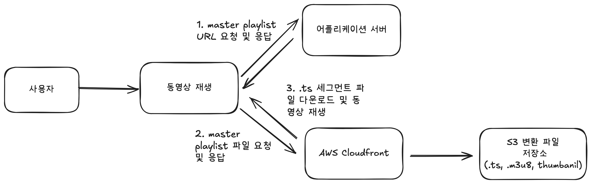

**1단계: 동영상 정보 요청**

시청자가 동영상을 클릭하면 클라이언트는 서버에 동영상 정보를 요청한다. 서버는 데이터베이스에서 동영상 상태를 확인하고, COMPLETED 상태인 경우에만 마스터 플레이리스트(master.m3u8) 파일의 CloudFront URL을 응답한다.

**2단계: 플레이리스트 다운로드 및 화질 선택**

비디오 플레이어는 CloudFront를 통해 마스터 플레이리스트를 다운로드한다. 마스터 플레이리스트에는 사용 가능한 화질 목록(720p, 480p, 240p)과 각 화질별 플레이리스트 위치가 담겨있다. 플레이어는 현재 네트워크 속도를 측정하여 적절한 화질을 선택한다. 예를 들어 6Mbps로 측정되었다면 안정적으로 재생 가능한 720p 4Mbps를 선택한다. 선택한 화질의 플레이리스트에는 10초 단위로 분할된 세그먼트 파일(.ts) 목록이 담겨있다.

**3단계: 세그먼트 다운로드 및 적응형 재생**

플레이어는 세그먼트 파일들을 순차적으로 다운로드하며 재생한다. 첫 번째 세그먼트(segment_0.ts)가 다운로드되면 바로 재생을 시작하고, 재생하는 동안 다음 세그먼트들(segment_1.ts, segment_2.ts...)을 미리 다운로드하여 끊김 없는 재생을 보장한다. 재생 중에도 플레이어는 지속적으로 네트워크 속도를 측정하여, 속도가 느려지면 자동으로 낮은 화질로 전환하고 빨라지면 높은 화질로 전환한다. 이것이 앞서 설명한 적응형 비트레이트 스트리밍(ABR)이다. 사용자는 화질이 순간적으로 조금 떨어지더라도 영상이 멈추지 않고 계속 재생되는 경험을 하게 된다.

## 3. **동영상 업로드 실시간 알람 설계**

### 1. 서비스 이해 및 해결해야 할 문제 파악하기

띵동 서비스에서 동영상 업로드가 필요한 곳은 피드를 생성할 때이다.

피드는 동아리 활동을 일반 학생들에게 쉽게 보여줄 수 있도록 만든 기능이다.

피드 생성은 총 3단계로 이루어져 있다.

1. 활동 내용을 입력한다.
2. 동영상을 업로드한다.
3. 업로드 하기 버튼을 클릭한다.

아래 실제 피드 생성 페이지를 보면 더욱 쉽게 이해할 수 있을 것 같다.

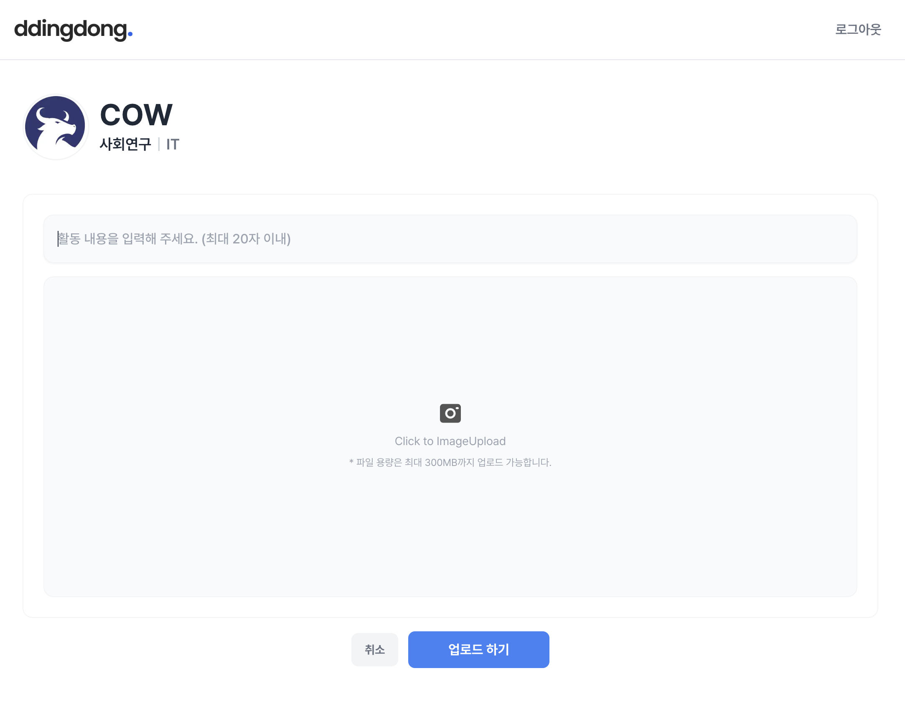

현재 동영상은 위에서 말했던 것과 같이 비동기 방식으로 업로드를 선택했다.

동영상 업로드를 성공적으로 끝났다는 것은 원본 동영상 업로드뿐만 아니라 트랜스코딩 및 변환 파일 저장까지 완료된 것을 의미한다. 하지만 현재 비동기 방식을 사용하면서 문제가 발생했다. 원본 동영상이 S3에 저장되는 즉시 사용자에게 "업로드 완료" 응답을 보내지만, 실제로는 백그라운드에서 트랜스코딩 작업이 여전히 진행 중인 상태다. 즉, 사용자는 업로드가 완료되었다고 생각하지만, 실제로 동영상을 재생할 수 있는 상태가 아닐 수 있다. 이러한 간극으로 인해 사용자 경험에 혼란이 생길 수 있으며, 트랜스코딩 실패 시 사용자에게 이를 알릴 방법이 없다는 문제가 있다.

따라서 트랜스코딩 및 변환 파일 저장이 완료된 시점에 사용자에게 알람을 보내는 기능이 필요하다.

어떻게 할 수 있을까? 가장 단순한 방법은 트랜스코딩 및 변환 파일 저장 작업까지 동기 작업에 포함시키는 것이다. 하지만 이 방법은 앞에서 말했던 것과 같이 한계가 명확하다. 그래서 나는 비동기 작업을 유지하면서 실시간으로 비동기 작업에 대한 성공 알람을 보내는 방법을 알아봤다.

동영상 성공 알람을 보여주는 시점은 아래 두 가지 경우가 있었다.

1.  사용자가 “업로드 하기”를 클릭하는 것과 관계없이 동영상 업로드를 한 후 업로드 완료되었다면 바로 알람을 보여주는 것
2. 사용자가 “업로드 하기”를 클릭했을 때만 동영상 업로드 완료 알람을 보여주는 것

팀 내 회의를 통해 두 번째로 결정하였다. 아직 피드 업로드를 안했는데, 동영상 업로드 완료 알람이 발생되면 어색할 것 같았기 때문이다.

> 사용자가 “업로드 하기”를 클릭했을 때만
>

이를 재해석해서 아래로 표현할 수 있다.

> 피드 작성을 완료했을 때만
>

알람 발생 조건에 **“피드 작성을 완료했을 때만”**이라는 사용자의 액션이 포함되어있기 때문에, 알람 전송 경우가 두 가지로 나뉘었다.

아래의 그림으로 살펴보자.

첫 번째는 사용자가 피드 작성을 완료하기 전, 동영상 업로드가 완료되었을 때이다.

이때는 동영상 업로드가 완료된 직후 알람을 보내지 않고 대기한 뒤, 사용자가 피드 작성을 완료했을 때 동영상 업로드 알람도 바로 전송을 해야한다.

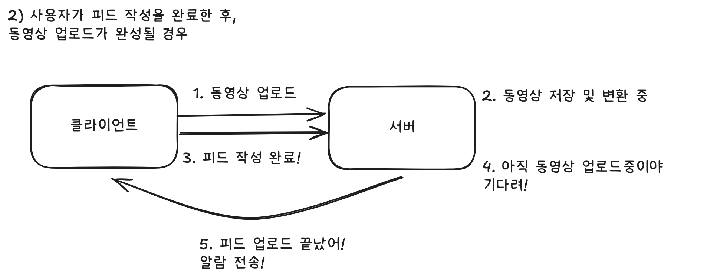

두 번째는 사용자가 피드 작성을 완료했지만, 동영상 업로드가 완료되지 않은 경우다.

이때는 동영상 업로드가 완료될 때까지 대기했다가 업로드가 완료되면 바로 알람을 전송하는 것이다.

나는 이 두 경우를 동영상 업로드 작업 및 알람 상태관리와 SSE를 통해 해결하였다.

동영상 업로드 작업 및 알람 상태관리로 사용자의 액션에 따라 달라지는 알람 시점을 해결하였고, SSE를 통해 비동기 작업으로 인해 응답 후 끊어지는 HTTP 비연결성을 해결하였다.

### 2. 상태관리 설계 및 SSE 설계

먼저 상태관리를 받을 테이블(Entity)를 VodProcessingJob, VodProcessingNotfication 두 개를 생성하였다.

VodProcessingJob에는 세 가지 상태가 있다.

- PENDING - 변환 작업 중
- COMPLETED - 변환 작업 완료
- ERROR - 변환 작업 실패

VodProcessingNotfication에는 네 가지 상태가 있다.

- PENDING - 알람 대기
- SENT - 서버에서 알람 전송
- COMPLETED - 클라이언트 알람 수신 완료
- FAILED - 알람 실패

이제 상태를 어느 시점에 변경시켰는지 알아보자.

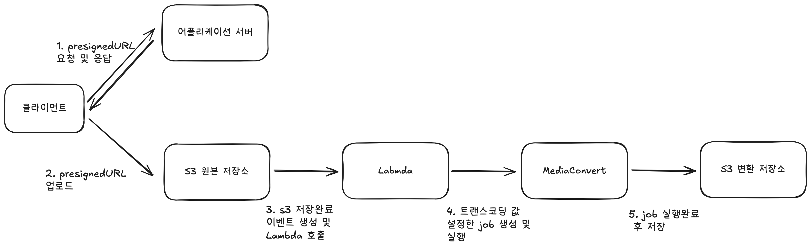

위 그림은 앞서 살펴봤던 동영상 업로드 파이프라인이다.

업로드 파이프라인에 하나씩 추가해 볼 것이다.

1. **VodProcessingJob, VodProcessingNotfication PENDING 상태 생성하기**

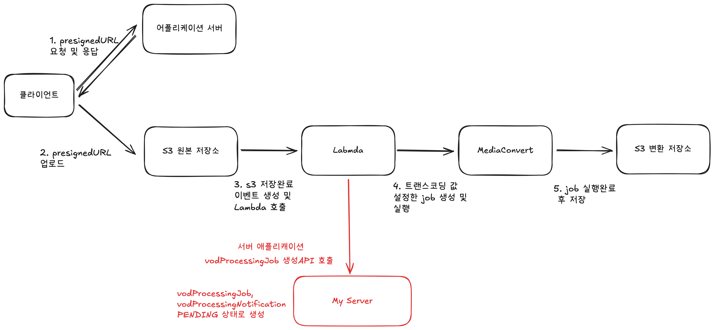

제일 먼저, S3 원본 저장소에 원본 동영상이 저장된 후 실행되는 Lambda 함수에 VodProcessingJob, VodProcessingNotification 상태를 PENDING으로 바꿔주는 서버 어플리케이션 API를 호출한다.

이때 동영상 변환 작업이 시작되었기에, 동영상 변환작업 히스토리성 엔티티와 동영상 변환작업 알람 히스토리성 엔티티를 준비시켜주는 작업이다.

2. **VodProcessingJob COMPLETED 상태로 변경하기**

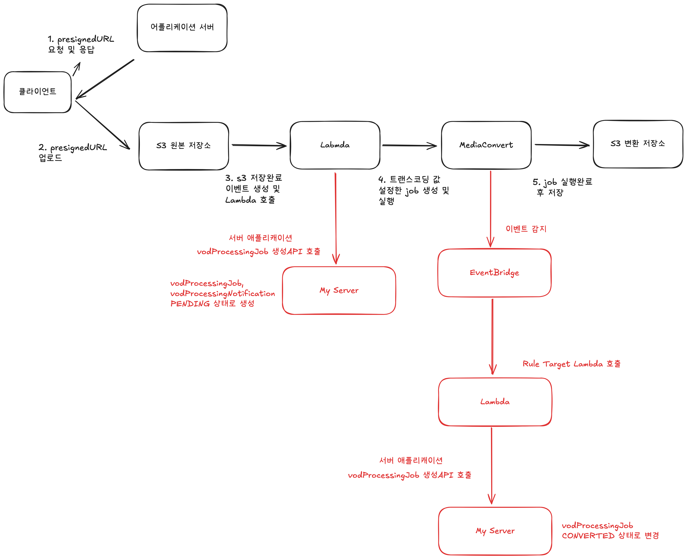

EventBridge가 Mediaconvert의 작업 완료 혹은 실패 이벤트를 감지하면 완료 처리를 담당하는 Lambda 함수가 실행된다.

이 Lambda는 이벤트에서 jobId와 status를 추출하여 서버 애플리케이션 API를 호출한다. 동영상 변환 작업이 성공하였을 경우, 서버는 해당 요청을 받아 동영상 상태를 COMPLETED로 변경하고, 변환된 파일의 S3 경로 정보를 저장한다.

**3-1 동영상 업로드 작업 관점에서 알람 전송**

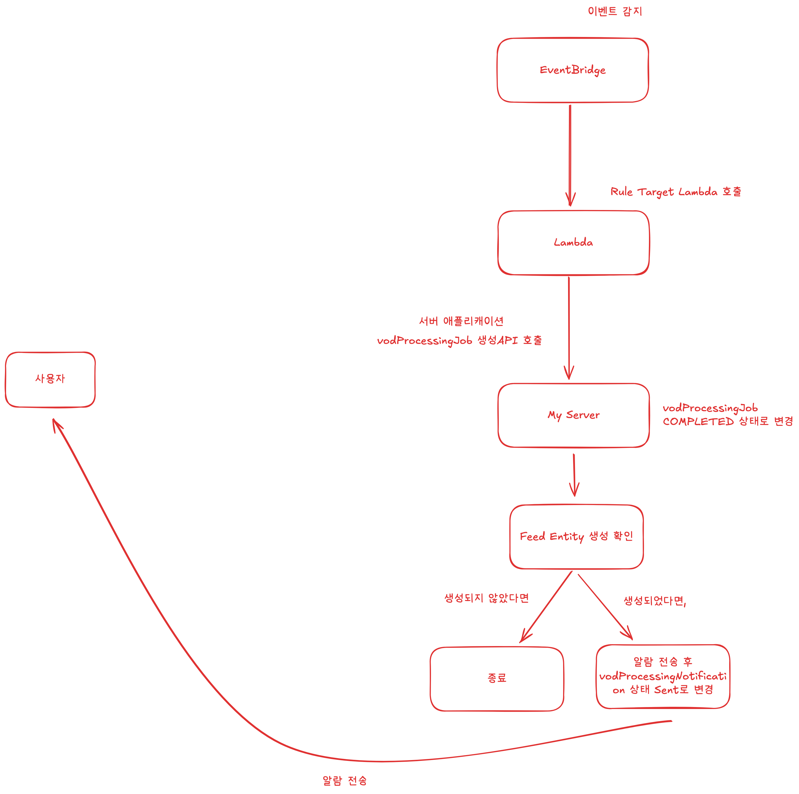

앞서 MediaConvert에서 작업이 완료되어 서버 API를 호출하여 VodProcessingJob을 COMPLETED로 변경한 후 알람 전송 작업을 추가로 진행해야한다.

사용자가 피드 작성을 완료했다면, 피드 작성 완료한 후 동영상 업로드가 완료되었으니 즉시 알람을 보내고 VodProcessingNotification 상태를 SENT로 변경시켜준다.

사용자가 피드 작성을 완료하지 않았다면, 피드 작성 완료 전 동영상 업로드가 완료되었으니 알람을 보내지 않고 그대로 종료한다.

**3-2 피드 생성 관점에서 알람 전송**

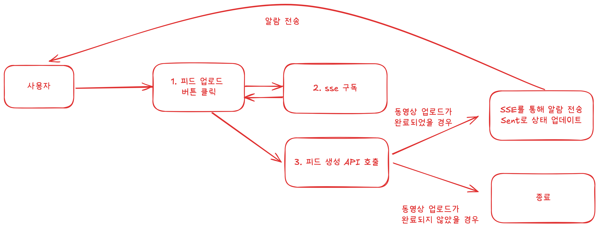

사용자가 피드 업로드 버튼을 클릭하면 실시간 알람을 위한 SSE구독 API를 먼저 호출한 후 피드 생성 API를 호출한다.

동영상 업로드가 완료되었을 경우 즉시 알람을 보내고 VodProcessingNotification 상태를 SENT로 변경시켜준다.

동영상 업로드가 완료되지 않았을 경우 기다려야하기 때문에 그대로 종료한다.

3. **클라이언트가 알람 수신 완료 API 호출**

클라이언트가 알람 수신 API를 호출함으로써 VodProcessingNotification 상태를 COMPLETED로 변경한다.

# 마무리

이번 글에서는 **동영상 스트리밍의 핵심 개념부터 업로드·처리 파이프라인 설계, 그리고 실시간 알림 구현까지** — 실제 서비스 상황을 기준으로 어떤 기술을 선택했고 왜 그렇게 결정했는지를 중점적으로 다뤘다.

다만, 글의 범위를 넘어서거나 깊이 있게 다루지 못한 부분도 있다.

**첫째, SSE, CDN 등의 기술적인 세부 구현과 이유를 충분히 설명하지 못하였다.**

간략하게 SSE는 비동기 트랜스코딩 완료 알림을 실시간으로 전달하기 위해 선택했고, CDN은 캐싱 및 S3전송 비용을 절감 및 접근 제어 역할을 위해 사용했다. 하지만 이 글에서는 핵심 설계 맥락에 집중하기 위해 해당 기술의 원리나 구현 방법까지는 다루지 않았다.

**둘째, 실패 전략(Failure Strategy)을 다루지 않았다.**

지금 글에서는 성공 플로우만 설명했지만, 실제 서비스 환경에서는 트랜스코딩 실패, 업로드 중단, 알림 전송 실패 등 다양한 예외 상황이 발생할 수 있다. 이 부분에 대한 **재시도 전략, 멱등성 보장, 알림 실패 대응 방안**은 안정적인 시스템 운영에 있어 매우 중요한 요소이며, 반드시 별도의 설계가 필요하다.

**셋째, 파일 메타데이터 관리에 대한 설명도 다루지 않았다.**

영상 자체만큼이나 메타데이터(파일 이름, 길이, 상태, S3 경로, jobId 등)를 관리하는 방법도 중요하다. 실제 서비스에서는 DB 등에 별도로 두고, 파일 상태와 처리 결과를 체계적으로 관리해야 한다.

**모든 기술을 선택한 이유가 명확하고 합리적이어야** 한다!

[Reference]

[https://en.wikipedia.org/wiki/Progressive_download](https://en.wikipedia.org/wiki/Progressive_download)

[https://en.wikipedia.org/wiki/Adaptive_bitrate_streaming](https://en.wikipedia.org/wiki/Adaptive_bitrate_streaming)

[https://cloudinary.com/guides/video-formats/pixel-perfect-h-264-vs-h-265-explained](https://cloudinary.com/guides/video-formats/pixel-perfect-h-264-vs-h-265-explained)

[https://docs.aws.amazon.com/mediaconvert/](https://docs.aws.amazon.com/mediaconvert/)

[https://aws.amazon.com/mediaconvert/pricing/](https://aws.amazon.com/mediaconvert/pricing/)

[https://developer.apple.com/streaming/](https://developer.apple.com/streaming/)
